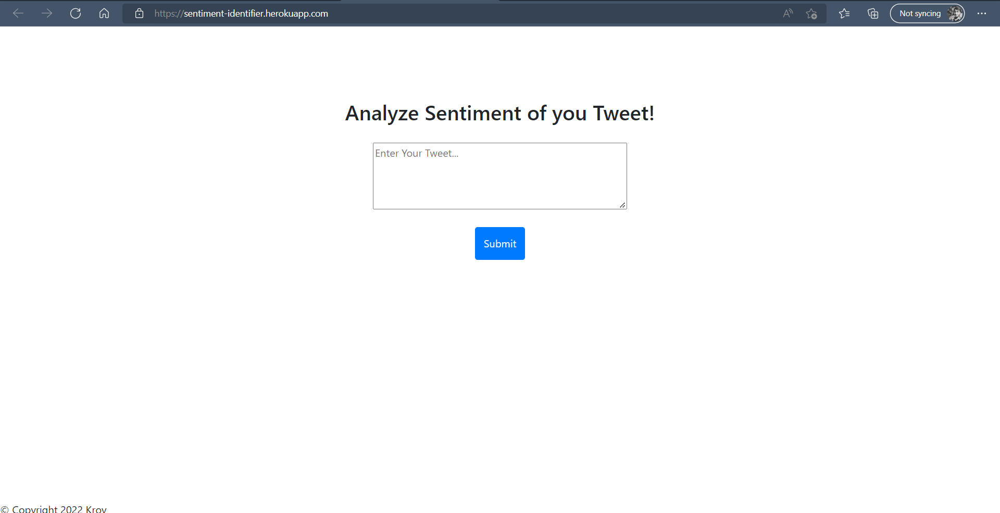
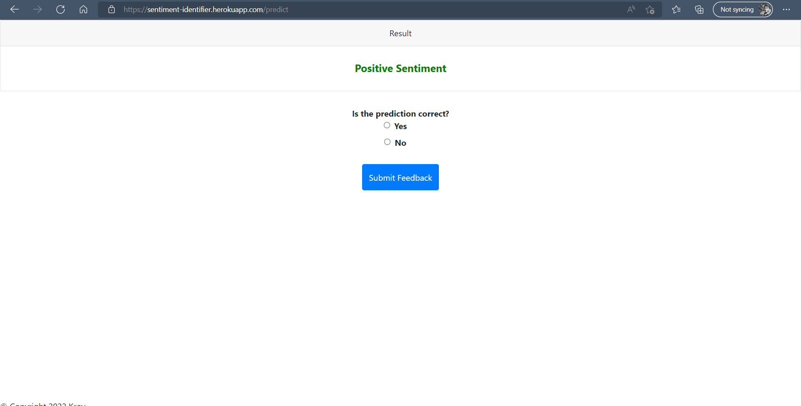

# Sentiment Analyzer

### UseCase:

In modern times customer reviews are not only constrained to the platform it sold on. It goes beyond it, to the social media
specifically `Twitter`.How do customers feel about your products or services? That’s important question business owners shouldn’t neglect. Positive and negative words matter. 
They can boost your business efforts or initiate a crisis.


# 🚀 Deployed App

[Launch App](https://sentiment-identifier.herokuapp.com/)

# Screenshots





# 🛠 Requirements 

Every package required to run the application is inside `requirements.txt`

RUN
```cmd
pip install -r requirements.txt
```

# 🏃‍♂️ How to run?

- Clone the repository
- Install python version specified in `runtime.txt`
- Install `requirements.txt`
- Create a cassandra database
- Download the config bundle
- Create credentials [ClientId, ClientSecret] 
- update config.yaml file
- Run `app.py`


# 👨‍💻 Tech Stack used

**Client:** HTML, CSS

**Server:** Python, Flask 

# 📑 FAQs

### What is the source of the data?

The data is from nltk's internal Twitter dataset

### What kind of processing is done of the data?

I have applied tokenization, lemmetization, removing symbols, removing stopwords

### Which model did you use?

I tried both machine learning and deep learning approaches and found out that in both case 
i'm getting almost the same performance so, considering the computer cost and complexity
i went with a `Logistic Regression` model.

### How is the performance of the model for data takes directly from Twitter?

I took around 10 positive and negative records tweets from different topic and 
the model performed quite well with a single miss classification in both catagory.

### What is the feedback option for?

I have saving the tweets with your feedback. So, hopefully if this feedback loops doesn't malfunction and i manage to gather enough data i'll upload the dataset to kaggle for public use.


# 👾 Bug Report

If you find any bugs, that i'm sure you'll please create an issue [here](https://github.com/Bijoy99roy/Sentiment-Analyzer/issues)
